# OpenDevUtils

**OpenDevUtils** is a comprehensive, open-source, offline-first developer utility toolbox. Built with security and privacy in mind, it provides dozens of essential tools for developers without ever sending your data to a server. Everything runs locally on your machine.

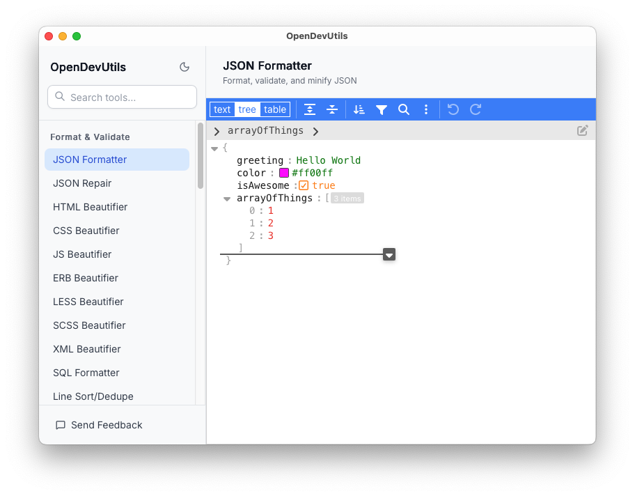

## Why OpenDevUtils

OpenDevUtils brings formatting, conversion, inspection, encoding, and generation tools into a single desktop workspace. It is designed for developers who want a fast local toolbox instead of bouncing between browser tabs and third-party web utilities.

- Offline-first workflows for sensitive payloads
- Light mode and dark mode across the shell
- A landing page for new users and a dense workspace for repeat use
- Built with Tauri, React, TypeScript, and Tailwind CSS

## Screenshot Gallery

### Landing Experience

| Dark | Light |
| --- | --- |
| 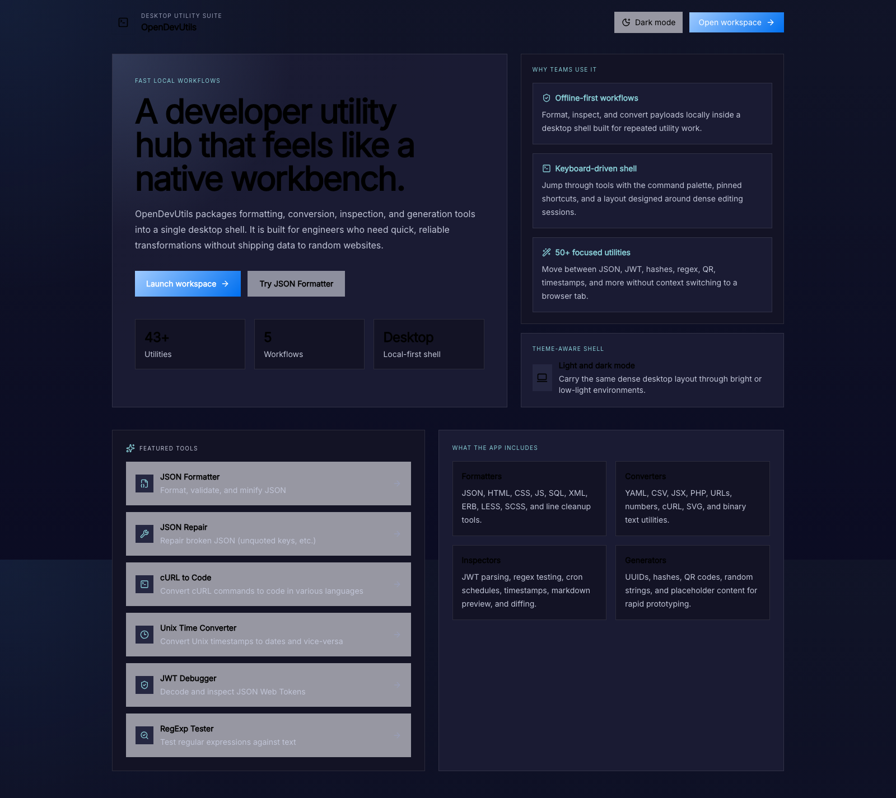 | 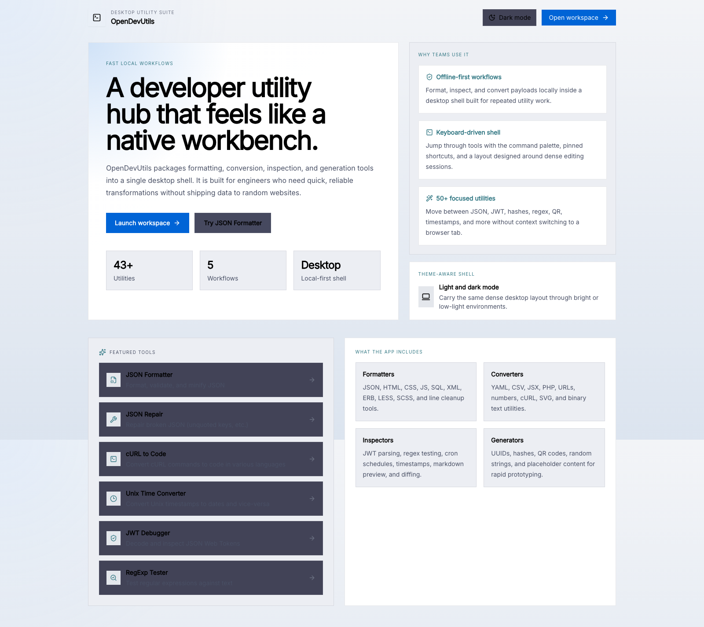 |

The landing page introduces the product, highlights the main value proposition, and routes users directly into the workspace or featured tools.

### Workspace Shell

| Dark | Light |
| --- | --- |
| 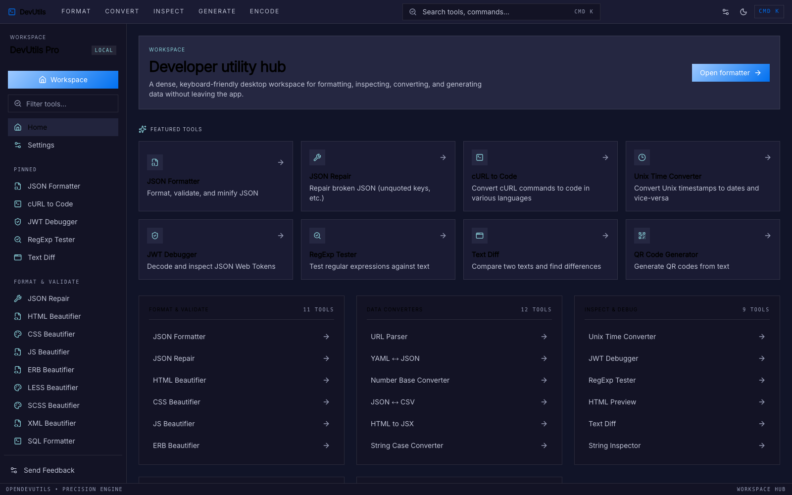 | 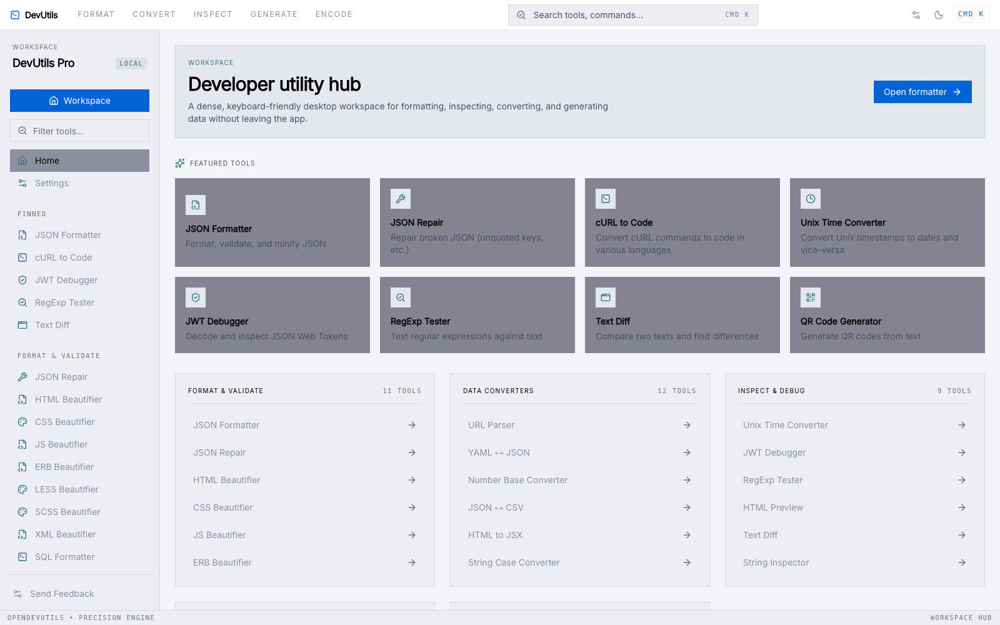 |

The main workspace is optimized for keyboard-driven navigation, pinned tools, and repeated data transformation tasks.

### Settings

| Dark | Light |
| --- | --- |
| 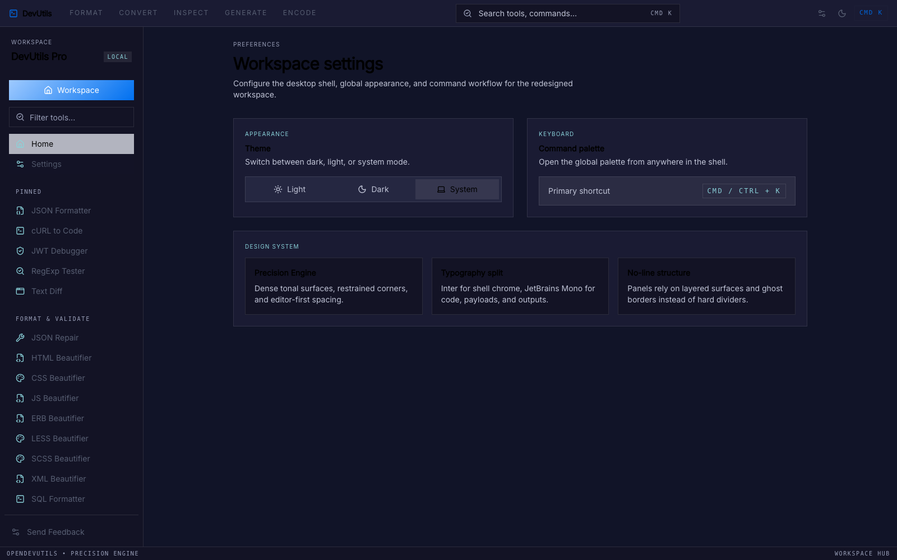 | 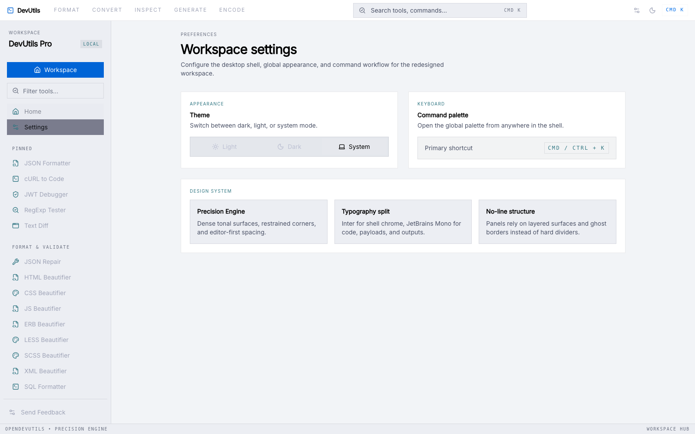 |

The settings screen exposes appearance controls and shell preferences for the desktop app.

### Tool Previews

#### JSON Formatter

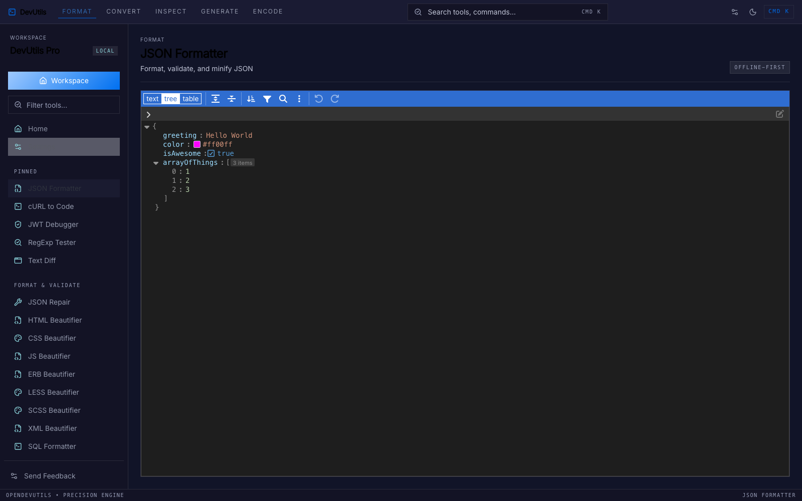

#### Text Diff

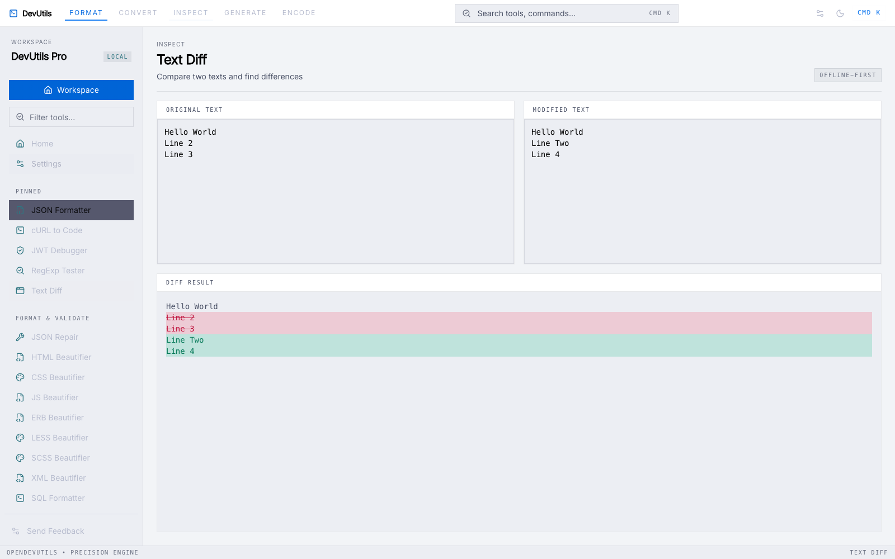

#### RegExp Tester

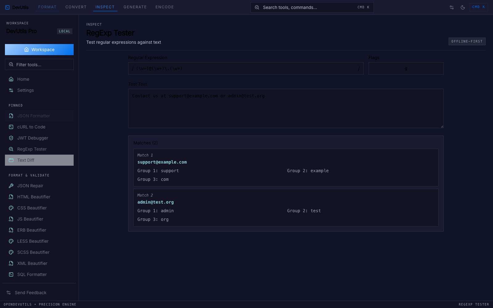

#### QR Code Generator

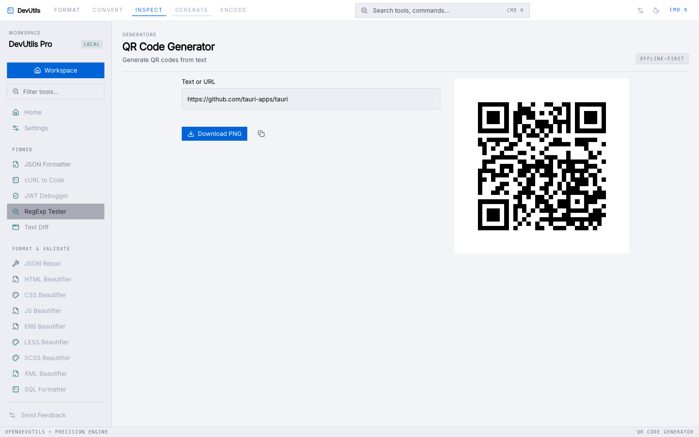

All screenshots are stored in [`assets/screenshots`](./assets/screenshots).

## 🚀 Key Features

OpenDevUtils includes over 40 individual tools across several categories, designed to streamline your development workflow:

### 🛠️ Data & Formatting
- **JSON Utilities**: Formatter, Repair (Offline), Repair to Code, and conversions to CSV, YAML, or PHP.
- **Beautifiers**: SQL, CSS, JavaScript, HTML, XML, Less, SCSS, and Erb.
- **Data Conversion**: Number Base Converter, Color Converter, Hex/ASCII, SVG to CSS, and HTML to JSX.

### 🔐 Security & Encoding
- **Encoding/Decoding**: URL, HTML Entities, Base64 (String & Image).
- **Security**: JWT Debugger, Certificate Decoder, and Hash Generator (MD5, SHA-1, SHA-256, etc.).
- **Generators**: UUID/ULID, Random String, QR Code, and Lorem Ipsum.

### ⏱️ Utilities & Previews
- **Time/Date**: Unix Timestamp converter and Cron Parser.
- **Analysis**: Text Diff, Regexp Tester, Line Sort/Dedupe, String Case Converter, and String Inspector.
- **Previews**: Markdown and HTML live previews.

## 📦 Tech Stack
- **Core**: [Tauri](https://tauri.app/) (High-performance Rust-based desktop framework)
- **Frontend**: [React](https://reactjs.org/) + [TypeScript](https://www.typescriptlang.org/)
- **Styling**: [Tailwind CSS](https://tailwindcss.com/)
- **Components**: [Base UI](https://base-ui.com/) & [Shadcn UI](https://ui.shadcn.com/)
- **Icons**: [Lucide React](https://lucide.dev/)

## 🛠️ Development

### Prerequisites
- [Node.js](https://nodejs.org/) (latest LTS)
- [Rust](https://www.rust-lang.org/) (stable)
- OS-specific Tauri dependencies ([Setup Guide](https://tauri.app/v2/guides/getting-started/prerequisites/))

### Quick Start
1. Clone the repository:
   ```bash
   git clone https://github.com/cflstudio/opendevutils.git
   cd opendevutils
   ```
2. Install dependencies:
   ```bash
   npm install
   ```
3. Run in development mode:
   ```bash
   npm run tauri dev
   ```
4. Build for production:
   ```bash
   npm run tauri build
   ```

## 💬 Feedback
We love feedback! If you find a bug, have a feature request, or just want to say hi, please send an email to [anhduc09t1@gmail.com](mailto:anhduc09t1@gmail.com).

## 📄 License
MIT
